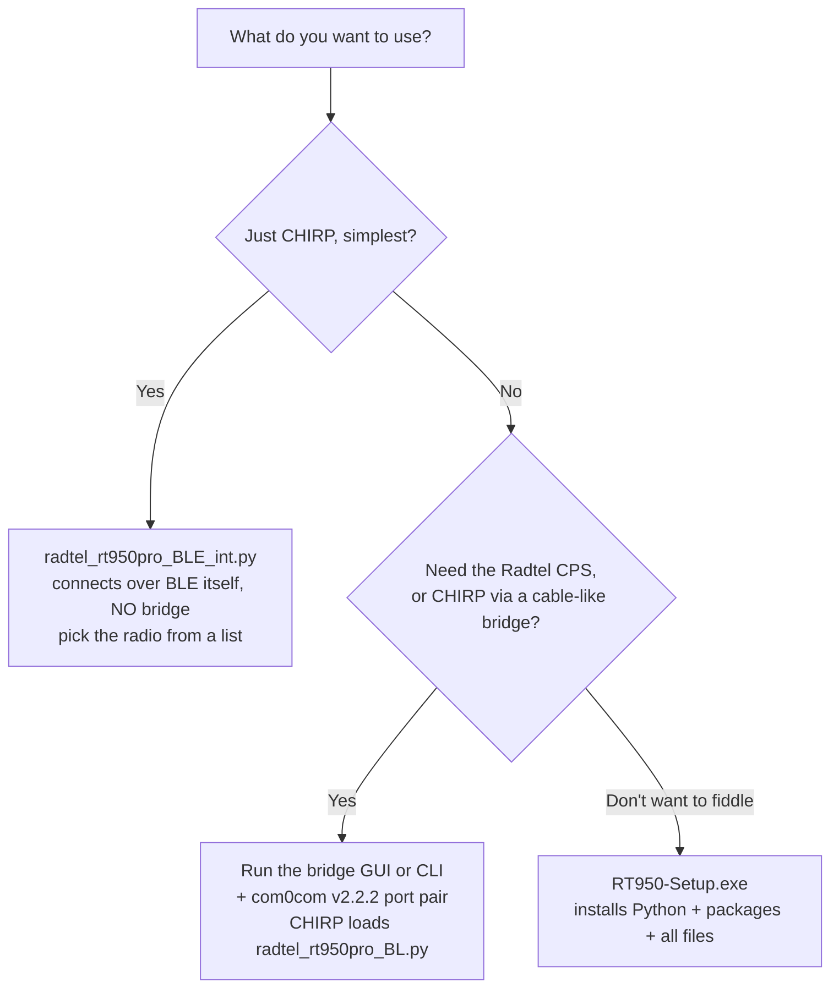

  

# Radtel RT-950 Pro — Bluetooth bridge for CHIRP and the Radtel CPS

Program the **Radtel RT-950 Pro** over **Bluetooth** instead of a USB cable —
from **CHIRP** *or* the **official Radtel BT-RT950PRO CPS**.

I wrote the Bluetooth side. It builds on the USB-cable memory format by Nathan
Barguss (2E0NBS): <https://github.com/NathanBarguss/Chirp_Radtel-RT-950-Pro>.

> ⚠️ Experimental. Writing can mis-program the radio. Always **Download first**
> and keep that `.img` as a backup. No warranty — use at your own risk.

## Pick your path

## What's in the download

| File | What it is |
|---|---|
| **`radtel_rt950pro_BLE_int.py`** | Integrated BLE driver — **no bridge**. Load it in CHIRP, pick the radio from a list, Download/Upload. **CHIRP only. Easiest path.** |
| **`radtel_rt950pro_BL.py`** | The CHIRP module to **Load Module** when you use the bridge. |
| **`ble_bridge.py`** | The **CLI bridge**. Makes Bluetooth look like a serial cable, so **CHIRP and the CPS** both work through it. Needs `bleak` + `pyserial`. |
| **`bridge_gui.py`** | The **GUI** version of `ble_bridge.py` — same job, with Start/Stop buttons and a device scanner. |
| **`RT950-Setup.exe`** | One-click installer: sets up Python 3.10 + `bleak`/`pyserial` and drops the files above on your PC. **Does not install com0com** (see below). |

Grab `RT950-Setup.exe` from the
[latest release](https://github.com/nivingoonesekera/Radtel-RT-950Pro-BLE-bridge-for-CHIRP-and-CPS/releases).

## Easiest way (CHIRP, no bridge)

1. Install **Python 3.10** from <https://www.python.org/downloads/> (keep the
   *py launcher* ticked), then run `pip install bleak`.
2. In CHIRP, enable `Help > Enable Developer Functions`.
3. `Radio > Load Module` → **`radtel_rt950pro_BLE_int.py`**.
4. `Radio > Download From Radio` → pick any COM port (it's ignored) → choose your
   radio from the list that pops up. Edit, then `Upload To Radio`.

Radio on, Bluetooth on, **not** connected to the phone app (so it can advertise).
It must be **Python 3.10** — CHIRP's build is 3.10 and `bleak`'s compiled parts
have to match. Skip the scan with `set RT950_BLE_ADDR=AA:BB:CC:DD:EE:FF`.

## Bridge way (the Radtel CPS, or CHIRP via a bridge)

You need a **virtual COM-port pair**. Install **com0com v2.2.2** — **not v3**,
which is unreliable on Windows 11 (the "fixes" you'll find online for v3 on Win11
are hit-and-miss). We deliberately leave com0com out of the installer so you put
on a version that works:

> **com0com v2.2.2 (signed):**
> <https://sourceforge.net/projects/com0com/files/com0com/2.2.2.0/com0com-2.2.2.0-x64-fre-signed.zip>

Then:

1. Make a pair of **two unused** COM ports (e.g. COM10 ↔ COM11) — com0com's Setup
   app (*Add Pair*, rename them) or `setupc install PortName=COM10 PortName=COM11`.
2. `pip install bleak pyserial`.
3. Start the bridge on **one** port — GUI: run `python bridge_gui.py`, pick the
   radio + that port, **Start**. CLI: `python ble_bridge.py COM10 --addr <MAC>`
   (wait for `unlock sent; bridge live`).
4. Point the **other** port at your program:
   * **CHIRP** → `Load Module` `radtel_rt950pro_BL.py`, port = the other port.
   * **Radtel CPS** → select the other port in its dialog.

   The bridge runs on **one** end, CHIRP/CPS on the **other** end — never the same
   port, and never a port something else is using.

Boot-logo upload isn't supported over Bluetooth — use the USB cable for that.

## If something goes wrong

* *"Could not import bleak"* → install Python **3.10** + `pip install bleak`. If
  still not found, set `RT950_BLEAK_SITE` to your `...\Python310\Lib\site-packages`.
* *Empty device list / not found* → radio on, Bluetooth on, not paired to the phone.
* *Bridge "live" but CHIRP/CPS can't open the port* → you're on the wrong end of
  the pair, or the ports aren't a real com0com pair. Confirm the pair, run the
  bridge on one and the app on the other.
* *A clone fails halfway* → just retry; keep your backup `.img`.

## Credits & licence

Bluetooth version by **Nivin Goonesekera (VK3NWG)**. Memory format from Nathan
Barguss (2E0NBS). Built on the open-source [CHIRP](https://chirpmyradio.com/)
project. MIT licence — see [LICENSE](LICENSE).
